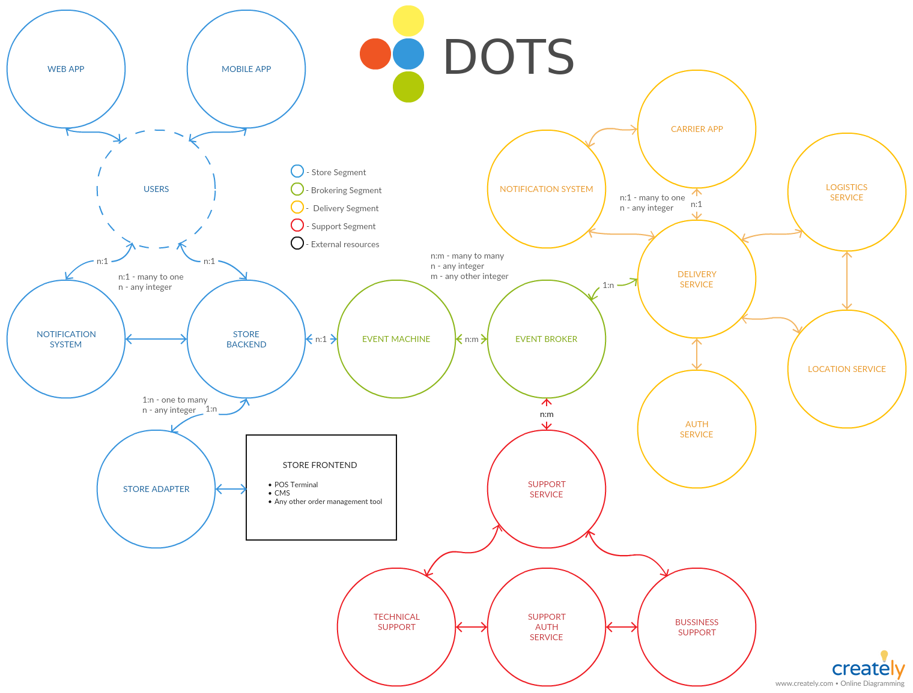

# DOTS Documentation

## Content

* Introduction
	* What is DOTS?
	* Basic component description
	* Why we should use inrgration with DOTS?
* Store Segment
	* Store Backend
	* Store Notification System for Client Apps
	* Store Adapters.
	* Customer client Apps (mobile and web).
* Brokering Segment
	* Event Machine pool.
	* Event Broker.
* Carrier Management Segment
	* Carrier Service 
	* Location Service
	* Auth Service
	* Notification Service for Carriers
	* Carrier Apps
	* Carrier Rating
* Supporting Segment
	* Tech Support Service
	* Business Support Service
	* Auth for Support
* General API documentation

